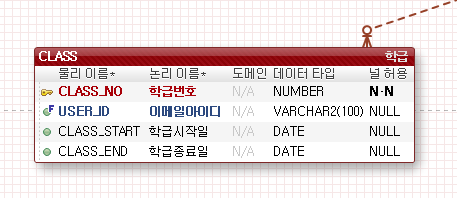

# CLASS TABLE(학급)

-학급 테이블이 수정되었습니다.

-CLASS 테이블은 학급 테이블로 학생들의 학급 정보가 입력되며 CLASS_ID 학급번호(PK), CLASS_START 학급시작일, CLASS_END 학급종료일,
CLASS_TITLE 학급강좌명,CLASS_NUM 학급기수,CLASS_ROOM 학급강의실 컬럼으로 구분됩니다.

-학급번호는 회원가입시 각자 수강하게 될 수업을 선택합니다.

-예비학생의 경우 예비 란을 두어 선택할수 있게 합니다.
-예비를 선택할 경우 학급강좌명,기수,강의실에 기본값을 부여합니다. 

-반장과 담임선생님은 USER TABLE 을 사용해서 정보를 가져옵니다.

-학급시작일과 학급종료일을 입력해두고 종료시 반장, 학급학생들은 회원등급을 수료학생 혹은 졸업생으로 변경하고 반장으로 할 수 있는 권한이 자동 사라지도록 처리합니다.(쿼리문으로 가능할것같습니다.)

담임선생님도 동일하게 처리하여 학급종료 후 다른반을 선택할 수 있게 합니다.

궁금한점이나 수정사항이 필요하다면 바로바로 말씀해주세요 :)