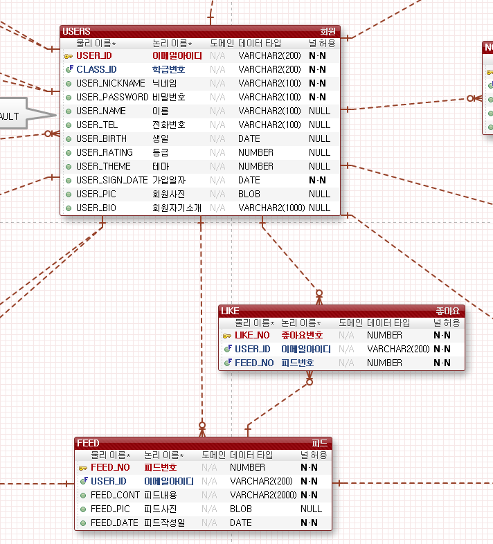

# LIKE TABLE (좋아요)

-LIKE 테이블은 피드에 좋아요를 누른 정보값이 저장되는 테이블입니다.

-LIKE_NO 좋아요번호(PK),
USER_ID(FK) 이메일아이디, FEED_NO(FK) 피드번호 로 컬럼 구성되어있으며
USERS 와 FEED 테이블의 PK를 사용합니다.

-LIKE_NO 컬럼은 PK를 부여하기위해 추가하였는데 불필요하면 삭제하도록 하겠습니다.

아래 사진을 참고해주세요.

궁금한점이나 수정사항이 필요하다면 바로바로 말씀해주세요 :)

