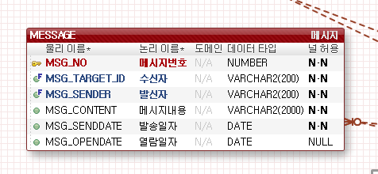
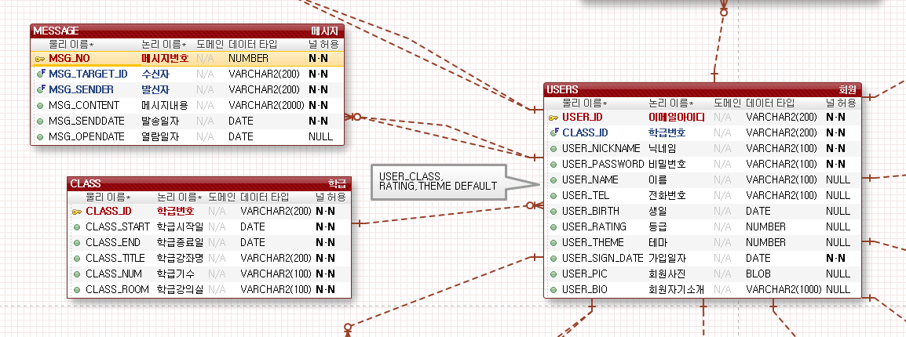

# MESSAGE TABLE (메시지)

-회원들간의 메시지가 저장되는 테이블입니다.

컬럼은

MSG_NO 메시지번호(PK)

MSG_TARGET_ID 수신자(FK)

MSG_SENDER 발신자 (FK)

MSG_CONTENT 메시지내용

MSG_SENDDATE 발송일자

MSG_OPENDATE 열람일자

로 구성되어있으며 FK 는 USERS TABLE의 USER_ID를 사용합니다.

열람일자를 제외하고 나머지 컬럼은 전부 NOTNULL 입니다.

아래 사진을 참고해주세요.

궁금한점이나 수정사항이 필요하다면 바로바로 말씀해주세요 :)

