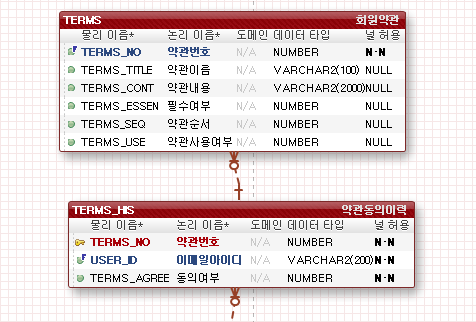
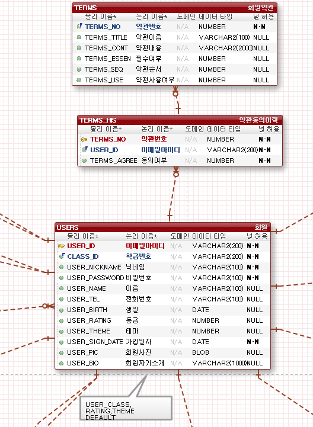

# TERMS_HIS TABLE(약관동의이력)
stipulation 테이블명이 너무 길어서 오류가 납니다. 
stipulation 를 TERMS 로 변경했습니다.

내용은 동일하며 컬럼명에만 변화가 있습니다.

-TERMS_HIS 테이블(TERMS_history)은 회원가입시 약관에 동의한 회원들의 정보가 입력되며 약관번호(PK), 이메일아이디(FK),동의 여부로 구분됩니다.

-이메일아이디는 USERS 테이블의 PK-KEY를 이용합니다. 

-약관마다 번호를 부여해 회원이 약관에 동의/비동의 여부를 판단하며 동의 여부는 숫자로 지정합니다.
ex) 약관번호(1) 이메일아이디 a001@gmail.com 동의여부(1) = 동의

# TERMS TABLE(회원약관)

-TERMS 테이블은 회원 약관에 관한 정보가 입력되며 약관번호(FK), 약관이름, 약관내용, 필수여부, 약관순서로 구분됩니다.

-약관 번호는 TERMS_HIS 테이블의 PK-KEY를 이용합니다.

-약관순서는 차후에 입력되는 약관이 웹상에 먼저 보여져야 하는 경우를 위해 넣어놨습니다.

[TERMS_HIS & TERMS]

[USER_TERMS]

궁금한점이나 수정사항이 필요하다면 바로바로 말씀해주세요 :)