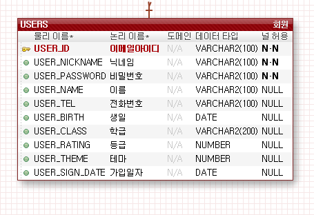
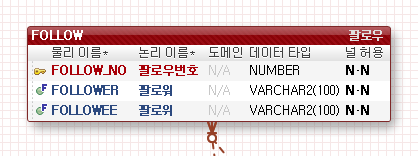
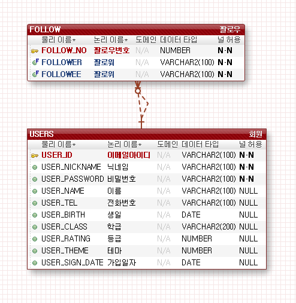

# USERS TABLE (회원)
-USERS 테이블은 Playddit 를 이용하는 회원들의 정보가 입력되며 이메일아이디(PK), 닉네임, 비밀번호, 이름, 전화번호, 생일,
 학급, 등급, 테마, 가입일자로 구분됩니다.

 -이메일아이디는 아이디 자체를 이메일 형식으로 입력받아
 회원가입시 링크를 통해 가입이 진행 될 수 있도록 처리합니다.

-이메일아이디, 닉네임, 비밀번호는 필수 기입이며 나머지는 null 가능합니다.

-학급은 option선택으로 입력을 받습니다. (학급테이블 별도)
ex) 202011_302 풀스텍

-등급은 숫자로 지정하며 학생, 교사, 수료생(졸업생), 예비학생 으로 나눕니다.

-테마는 일반모드와 다크모드 선택을 위해 있으며 기본 실행시 값을 미리 넣어 일반모드로 적용시키며 환경설정에서 변경 할 수 있도록 합니다.
ex)USERS_THEME DEFAULT 0 은 일반모드 1은 다크모드 환경설정 변경가능  

[users table]

# FOLLOW TABLE (팔로우)
-FOLLOW 테이블은 Playddit 회원들 간 친구를 맺을 경우 정보가 입력되며 필로우번호(PK), 팔로워(FK), 팔로위(FK)로 구분됩니다.

-Follower(팔로워) 는 'follow'를 하는 유저 followee(팔로위) 는 follower 에게 follow를 받는 유저를 뜻합니다.

-Follower 와 followee 모두, users 테이블에서 Foreign key 로 연관되어 있습니다.

[follow table]

[users - follow table]

궁금한점이나 수정사항이 필요하다면 바로바로 말씀해주세요 :)
